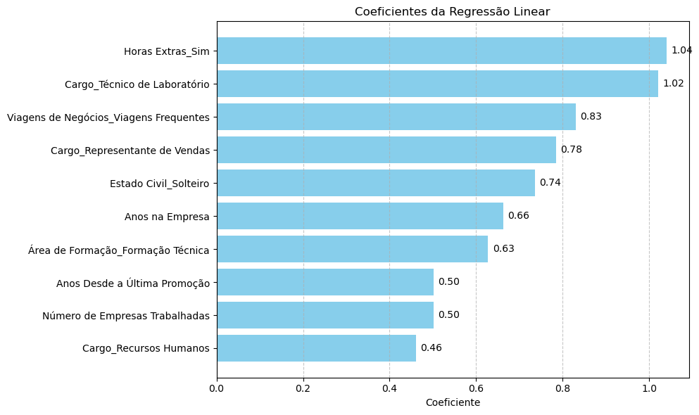

# 📊 Satisfação do Funcionário

Este projeto implementa modelos de aprendizado de máquina (**Regressão Logística**) para identificar os principais fatores que contribuem para a **rotatividade de funcionários** (employee turnover).

---

## ⚙️ Pré-processamento dos Dados

Utilizamos um pipeline completo com as seguintes etapas:

- `StandardScaler` – Normalização de variáveis numéricas  
- `OneHotEncoder` – Codificação de variáveis categóricas  
- `SimpleImputer` – Imputação de valores ausentes  
- `ColumnTransformer` – Transformações distintas por tipo de variável  
- `Pipeline` – Integração de todo o fluxo de pré-processamento e modelagem

---

## 🤖 Modelo Utilizado

- **Regressão Logística** – Classificador linear adequado para problemas binários

---

## 📈 Métricas de Avaliação

- **AUC (Área sob a Curva ROC)** – Avaliação da capacidade de classificação  
- **Coeficientes do Modelo** – Análise da influência de cada variável nas predições

---

## 🧾 Resultados

O modelo conseguiu identificar variáveis com maior impacto na **probabilidade de rotatividade de funcionários** com acuracia de 0.89.

Visualização dos coeficientes estimados pelo modelo:

***Interpretação dos Resultados:***

1. **Horas Extras Sim 1,039938**

Uma distância maior de casa para o trabalho está associada a uma maior probabilidade de demissão voluntária. Longos deslocamentos podem causar burnout e insatisfação.

2. **Função Técnico de Laboratório 1,020678**

Funcionários que trabalham como técnicos de laboratório têm maior probabilidade de pedir demissão voluntariamente. Isso pode indicar insatisfação com a função específica ou com o ambiente de trabalho.

1. **Viagens de Negócios Frequentes 0,830317**

Funcionários que viajam frequentemente a negócios têm maior probabilidade de pedir demissão voluntariamente. Este coeficiente é bastante significativo, sugerindo que a frequência de viagens pode ser um fator de estresse ou insatisfação.

4. **Função Representante de Vendas 0,784274**

Funcionários que trabalham como representantes de vendas têm maior probabilidade de pedir demissão voluntariamente. Essa função pode ter alta pressão de desempenho ou falta de suporte adequado.

5. **Estado Civil: Solteiro 0,735787**

Funcionários solteiros têm maior probabilidade de pedir demissão voluntariamente em comparação com funcionários casados ou em outros estados civis. Isso pode ser devido à maior flexibilidade e à redução de responsabilidades pessoais.

6. **Anos na Companhia 0,663086**

Quanto mais anos um funcionário passou na empresa, maior a probabilidade de pedir demissão voluntariamente. Isso pode indicar que, após um certo período, os funcionários podem se sentir estagnados ou buscar novas oportunidades.

7. **Formação Técnica 0,627767**

Funcionários com formação técnica têm maior probabilidade de pedir demissão voluntariamente em comparação com aqueles com outras formações. Isso pode indicar que esses funcionários têm mais oportunidades no mercado de trabalho ou que suas expectativas não estão sendo atendidas.

8. **Anos desde última promoção 0,502098**

Funcionários que passaram mais anos desde a última promoção têm maior probabilidade de pedir demissão voluntariamente. Isso pode indicar insatisfação com as oportunidades de crescimento dentro da empresa.

9. **Número de Companhia Trabalhadas 0,501348**

Funcionários que trabalharam para um número maior de empresas ao longo da carreira têm maior probabilidade de pedir demissão voluntariamente.

10.  **Função Recursos Humanos 0,460598**

Funcionários que trabalham como recursos humanos têm maior probabilidade de pedir demissão voluntariamente. Essa função pode apresentar alta pressão de desempenho ou falta de suporte adequado.

Em outras palavras, analisar os coeficientes de um modelo de regressão logística nos ajuda a entender a influência de cada atributo na probabilidade do evento de interesse. Coeficientes positivos indicam que, à medida que o valor do atributo aumenta, a probabilidade de o funcionário pedir demissão voluntariamente também aumenta.

---
## 🧾 ToDo:
* "Uma análise da distância de casa por função e rotatividade" ou "comparação entre a renda média mensal por educação e rotatividade".

Outros pontos:
- Dicionário de Dados
- Análise Exploratoria
- Turnover ?
- Variaveis x Variável Target/Rotatividade
- Comparativos entre as variáveis: Distancia x rotatividade, Renda x Educação x Rotatividade.
- Outros projetos para mesmo dataset?