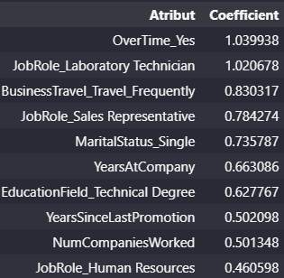

# Employee_Satisfaction

Implementing machine learning models for identify Factors Contributing to Employee Atrittion.

**Pre-processing:**
- StandScaler
- OneHotEncoder
- SimpleImputer
- ColumnTransformer
- Pipeline

**Models Classifier:**
- Logistic Regression

**Metrics:**
- AUC (accuracy_score)
- Coefficients

**Results:**
Employee Atrittion
